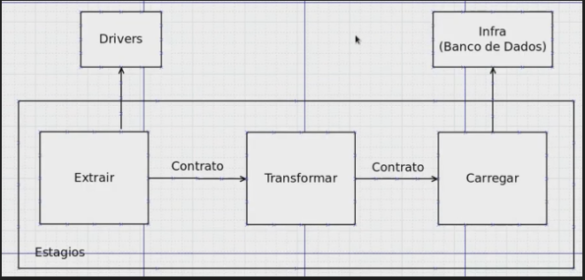
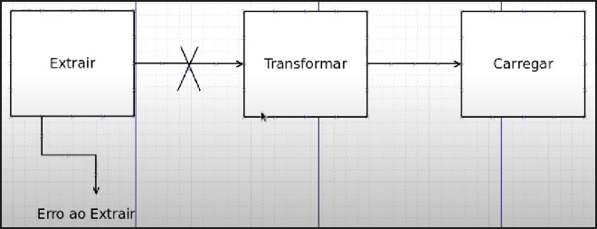

https://www.youtube.com/watch?v=9jqFq3muxRU&ab_channel=ProgramadorLhama

## Princípios de Arquitetura

Drivers - Condutores/Bibliotecas externas para realizar a extração dos dados.
* Deve ser dinâmica, ou seja, terei a flexibilidade para trocar de bibliotecas, ou seja, a bibloteca não deve estar amarrada ao meu código.

Contrato - Tipo de formatação que o dado deve assumir.
* Os estágios se comunicam atráves de um contrato. Eu sei como o dado deve sair de um estágio e sei como ele deve chegar em outro estágio.
* Trata-se de um padrão entre troca de informação.

Infra (Banco de Dados) - Local em que os dados serão armazenados.
* Os elementos que se relacionam com o Banco de Dados estarão fora do estágio de Load/ fora da construção.

## Tratamento de Erros

* Os erros devem ser explicitados de forma clara a cada estágio do pipeline.
* O pipeline deve ser interrompido a cada erro encontrado durante um estágio.
    * O processo deverá ser interrompido e o erro deverá ser localizado.